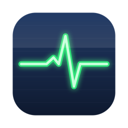

<p align="center">
  
</p>

<h1 align="center">MacPulse</h1>

<p align="center"><b>Free, open-source Mac cleaner and system monitor. A native macOS utility suite that checks CPU temperature, cleans System Data storage, finds duplicate files, fully uninstalls apps, and audits startup items - all in one app.</b></p>

<p align="center">
  
  
  
  
</p>

## What is MacPulse?

MacPulse is a free alternative to paid Mac cleaner and monitoring apps. It combines the jobs of a system monitor, storage cleaner, duplicate finder, app uninstaller, startup manager, and screenshot organizer into a single native Swift app with a live menu bar widget. No subscription, no telemetry, no network access, and the entire codebase is readable in an afternoon.

## Features

| Tool | What it does |
|---|---|
| **Dashboard** | Live CPU, battery, and SSD temperature from real sensors (no sudo needed), thermal pressure, memory and swap usage, disk space, and the apps using the most memory with one-click Quit. |
| **Disk Map** | Interactive sunburst chart of what's eating your disk (like DaisyDisk). Click a segment to zoom in, click the center to go back up, trash things straight from the map. |
| **Clean Storage** | Reclaims "System Data" bloat: app caches, logs, developer caches (Xcode DerivedData, npm), Trash, old iOS backups, and Time Machine local snapshots. Whitelist-only - it never touches paths it doesn't recognize. |
| **Duplicates & Large Files** | Finds duplicate files by content (size + SHA-256) and lists your 100 largest files with last-opened dates. Preview anything with Quick Look (Space bar, arrow keys) before deleting. |
| **Uninstall Apps** | Deletes an app AND its leftovers: Application Support, Caches, Preferences, Containers, LaunchAgents. Drag, drop, review, done. |
| **Startup Items** | Shows every launch agent, daemon, and login item. Flags orphans left behind by apps you already deleted. Disabling is reversible. |
| **Screenshots** | Auto-files new screenshots and screen recordings into monthly folders so they stop piling up on your Desktop. |
| **Menu bar widget** | CPU temperature and memory usage next to the clock, colored by heat and memory pressure. Customizable colors, refresh rate, and Celsius/Fahrenheit. |

Every deletion flow is safety-first: confirmation dialogs, Trash instead of permanent deletion wherever possible, files in use are skipped, and non-regenerable items (iOS backups, Trash) are labeled PERMANENT and unchecked by default.

## MacPulse vs other Mac utilities

| | MacPulse | CleanMyMac | Stats | AppCleaner | OnyX |
|---|---|---|---|---|---|
| Price | Free | $40/yr | Free | Free | Free |
| Open source | Yes | No | Yes | No | No |
| Storage cleaning | Yes | Yes | No | No | Yes |
| Disk space map (sunburst) | Yes | Yes | No | No | No |
| Temperature / memory monitor | Yes | Menu bar | Yes | No | No |
| Duplicate finder | Yes | Paid extra | No | No | No |
| Full app uninstaller | Yes | Yes | No | Yes | No |
| Startup item auditor | Yes | Yes | No | No | No |
| Screenshot organizer | Yes | No | No | No | No |
| Telemetry / network calls | None | Yes | None | None | None |

Each of those tools is good at its own job. MacPulse exists because keeping a Mac fast usually needs four of them at once.

## Install

Build from source (needs Xcode Command Line Tools: `xcode-select --install`):

```sh
git clone https://github.com/panwardev687/macpulse.git
cd macpulse
./build_app.sh
open MacPulse.app
```

The build is a single `swiftc` invocation and takes a few seconds. No Xcode project, no package manager, no dependencies.

To start MacPulse at login, flip the toggle in Settings inside the app.

## Frequently asked questions

### How do I check my Mac's CPU temperature?

Open MacPulse and the CPU temperature appears in the menu bar next to the clock, read directly from the Apple Silicon die sensors via IOKit. No sudo, no kernel extension, no helper daemon. The Dashboard pane adds battery and SSD temperatures plus the current thermal pressure state.

### Why is System Data so large on my Mac, and is it safe to clean?

System Data grows because macOS and your apps cache aggressively: browser caches, Xcode DerivedData, package manager caches, logs, and Time Machine local snapshots. These are regenerable by design, so clearing them is safe - an app that finds its cache missing simply rebuilds it. MacPulse only cleans a whitelist of known-safe locations and labels anything permanent.

### Does cleaning caches make a Mac faster?

Indirectly, yes. Files sitting on disk don't slow a Mac down, but a nearly full disk does: macOS wants 10-15% free space for swap and snapshots. If your disk is over 85% full, freeing 20-30 GB gives a real, measurable improvement. MacPulse shows a warning when you cross that threshold.

### How do I see what is taking up space on my Mac?

Open MacPulse's Disk Map pane and scan your home folder (or any folder). It draws an interactive sunburst chart where every arc is sized by how much space it uses: bigger arc, bigger folder. Click a segment to zoom into that folder, click the center to go back up, and move anything to the Trash directly from the map.

### How do I completely uninstall an app on macOS?

Dragging an app to the Trash leaves behind its Application Support folders, caches, preferences, and launch agents. MacPulse's Uninstall pane finds all of them by bundle ID, shows each with its size, and moves everything to the Trash so it stays recoverable.

### Is MacPulse a good free CleanMyMac alternative?

For cleaning, uninstalling, startup management, and monitoring: yes, and it adds duplicate finding and screenshot organizing. CleanMyMac has a more polished onboarding and a malware scanner, which MacPulse does not include. MacPulse is MIT-licensed, makes zero network connections, and you can audit every line it runs.

### Why isn't MacPulse on the Mac App Store?

The temperature sensors use a private IOKit API and the cleaner needs direct Library access, both of which App Store sandboxing forbids. That's the same reason tools like CleanMyMac and AppCleaner distribute outside the store. Build from source or watch Releases for notarized builds.

## Permissions

macOS prompts for these on first use. Each is optional and only gates its own feature:

- **Desktop/Documents/Downloads access** - file scanning and screenshot organizing
- **Automation (System Events)** - listing and removing login items
- **Full Disk Access** - only for Trash size reporting and iOS backup cleanup

MacPulse makes zero network connections. No analytics, no telemetry, no update phone-home. The only outbound links are the GitHub buttons in Settings.

## Repository layout

```
MacPulseApp/          <- the unified app (start here)
  Main.swift            app shell + sidebar navigation
  StatusBar.swift       menu bar widget + app delegate
  DashboardView.swift   live system overview
  DiskMapView.swift     interactive disk space sunburst
  CleanView.swift       storage cleaner
  FilesView.swift       duplicates & large files + Quick Look
  UninstallView.swift   app uninstaller
  StartupView.swift     launch agent auditor
  ShotsView.swift       screenshot organizer
  Settings.swift        preferences and launch-at-login
  Sensors.swift         IOKit temperature reading
  MemoryStats.swift     memory pressure / per-app usage
  Shared.swift          common helpers
build_app.sh          <- builds MacPulse.app
scripts/make_icon.swift  regenerates the app icon programmatically
```

The repo also contains the original standalone single-purpose apps (each is a complete app in one Swift file, useful as minimal examples) and a Python CLI (`macpulse.py`) with SQLite history and a browser dashboard:

```sh
./macpulse                   # snapshot: temps, CPU, memory, battery
./macpulse watch -i 30       # continuous sampling
./macpulse dashboard         # live charts at http://127.0.0.1:8321
./macpulse why               # "why is my Mac hot?" - heat attribution
```

## Contributing

Issues and PRs welcome. The codebase is intentionally simple: one view file per pane, models are plain `ObservableObject`s, helpers live in `Shared.swift`. Build with `./build_app.sh`, no other tooling required.

## More free Mac tools

- [DeskPulse](https://github.com/panwardev687/deskpulse) - clipboard history, text snippets, file conversion, and a full PDF + image toolbox (merge, split, compress, OCR, PDF to Word, background removal) in one 3 MB app. Free alternative to Paste, TextExpander, and the iLovePDF web tools.

## Support

If MacPulse keeps your Mac cool, fast, and tidy, consider [sponsoring development](https://github.com/sponsors/panwardev687).

## License

[MIT](LICENSE)
